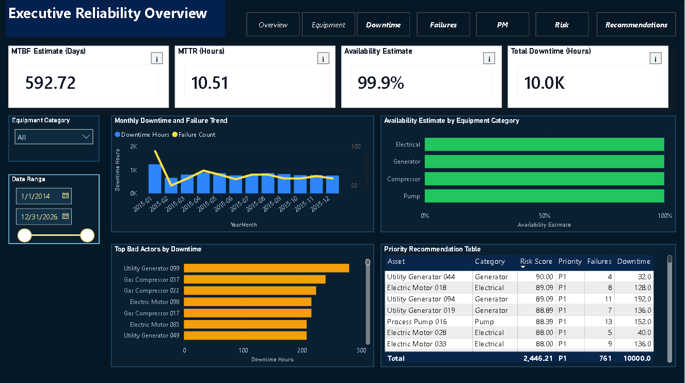
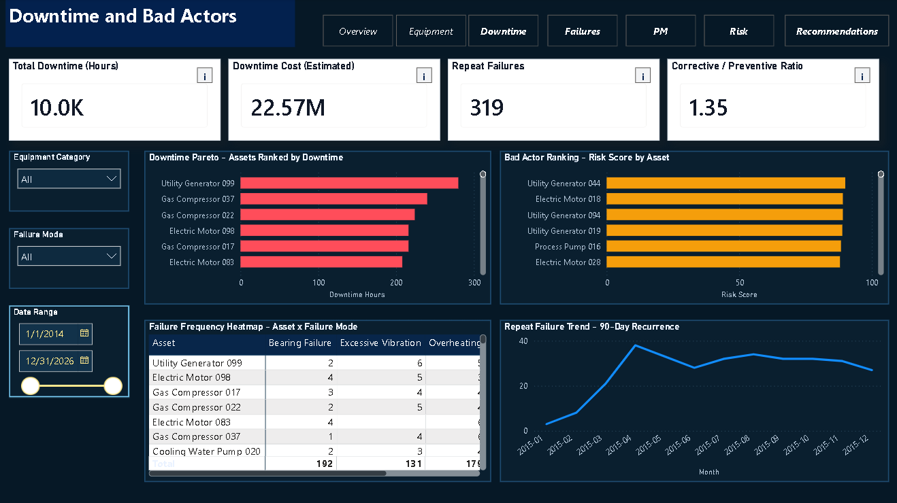
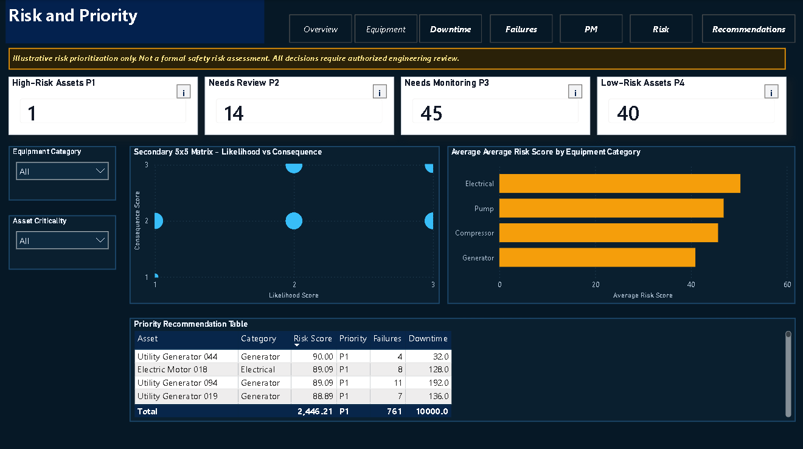
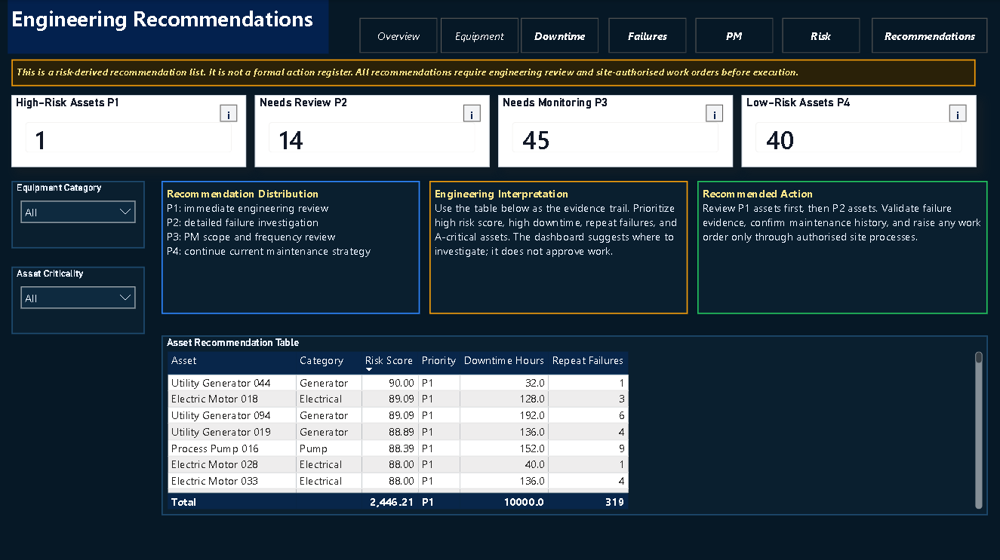

# LNG Reliability Dashboard

[](https://powerbi.microsoft.com/)
[](https://www.python.org/)
[](LICENSE)

## Important Disclaimer

This project uses public and simulated industrial reliability-style data adapted
into LNG maintenance and asset-management categories for portfolio
demonstration.

It does not contain, use, or claim to use ExxonMobil, PNG LNG, or any real plant
operating data. It does not contain confidential, proprietary, licensee, or
employer-owned data. It is not affiliated with or endorsed by ExxonMobil, PNG
LNG, or any LNG operator.

This dashboard is an engineering analytics portfolio project. It is not a live
plant dashboard, not a formal safety risk assessment, not a digital twin, and not
a mechanical integrity approval tool.

## Project Summary

This project demonstrates how reliability, maintenance, and failure-history data
can be transformed into a professional Power BI dashboard for asset performance
review, downtime analysis, bad-actor identification, preventive maintenance
monitoring, risk prioritization, and engineering recommendations.

The final dashboard is designed for a reliability or maintenance engineering
review workflow: start with an executive summary, identify the assets and failure
modes driving downtime, review PM performance, prioritize risk, and drill into
asset or failure-mode detail before recommending action.

## Final Dashboard File

Open the final Power BI report here:

[lng_reliability_dashboard_v0.2_final_darkpolish_v5.pbix](lng_reliability_dashboard_v0.2_final_darkpolish_v5.pbix)

This is the portfolio-ready version. Archived PBIX versions are retained locally
in `archive_pbix_versions/` and intentionally excluded from the repository.

## Dashboard Screenshots

### Executive Overview



### Downtime and Bad Actors



### Risk and Priority



### Engineering Recommendations



## Dashboard Pages

- **Executive Overview** - high-level reliability KPIs, monthly downtime trend,
  availability by equipment category, bad actors, and priority table.
- **Equipment Performance** - equipment category performance matrix, failure
  mode distribution, asset-level reliability detail, and monthly failure trends.
- **Downtime and Bad Actors** - downtime Pareto, risk-ranked bad actors, failure
  frequency heatmap, and repeat-failure trend.
- **Failure Modes and Root Causes** - failure mode Pareto, root-cause mechanism
  distribution, failure mode by equipment category, and failure trend.
- **PM Performance** - preventive maintenance compliance, overdue worklist,
  PM status trend, and corrective/preventive ratio.
- **Risk and Priority** - illustrative risk ranking, priority bands, secondary
  likelihood/consequence view, and ranked recommendation table.
- **Engineering Recommendations** - risk-derived recommendation summary,
  interpretation notes, recommended actions, and asset recommendation table.
- **Asset Detail** - drill-through page for one asset's reliability profile.
- **Failure Mode Detail** - drill-through page for affected assets by failure
  mode.

## Key KPIs

| KPI | Purpose |
|---|---|
| MTBF Estimate | Estimated operating days divided by failure count |
| MTTR | Total repair hours divided by failure count |
| Availability Estimate | Estimated availability: MTBF / (MTBF + MTTR / 24), using MTBF in days and MTTR in hours |
| Total Downtime Hours | Total production-impacting downtime in the selected context |
| Failure Count | Count of recorded failure events |
| PM Compliance | On-time PMs divided by valid scheduled PMs; the PM schedule is simulated for portfolio demonstration and does not represent confidential or actual LNG operating data |
| Corrective / Preventive Ratio | Corrective maintenance volume compared with preventive maintenance volume |
| Risk Score | Illustrative prioritization score for asset review |
| Priority Level | P1-P4 action grouping based on risk score and reliability indicators |

## Data Model

The dashboard uses a simple star-schema style model:

- `dim_Asset`
- `dim_Date`
- `dim_FailureMode`
- `dim_MaintenanceAction`
- `fact_Failure`
- `fact_Maintenance`
- `fact_PM_Compliance`
- `Measure_Table`

The processed CSV files are stored in `data/processed/`.

## How To Review This Project

For a quick portfolio review:

1. Open `lng_reliability_dashboard_v0.2_final_darkpolish_v5.pbix` in Power BI
   Desktop.
2. Review the four screenshots in `screenshots/`.
3. Use Ctrl + click on the top navigation buttons inside Power BI Desktop.
4. Test drill-through from asset bars to **Asset Detail**.
5. Test drill-through from failure mode bars to **Failure Mode Detail**.
6. Hover over the small `i` markers on KPI cards for KPI definitions.

## Public Data And Assumptions

This repository uses public and simulated datasets to demonstrate engineering
analytics workflow without exposing real plant data. The values are suitable for
portfolio demonstration, data-modeling practice, and dashboard storytelling, but
not for operational decision-making.

See [docs/data_sources.md](docs/data_sources.md) for source details and
attribution.

## Repository Structure

```text
.
|-- data/
|   |-- processed/           # Dashboard-ready processed CSV files
|   `-- README.md
|-- docs/                    # Data source notes and project documentation
|-- excel/                   # Earlier Excel workbook artifact
|-- notebooks/               # Reserved for notebook workflow
|-- reports/                 # Supporting reports and release notes
|-- samples/                 # Small GitHub-safe sample files
|-- screenshots/             # Power BI portfolio screenshots
|-- scripts/                 # Reproducible Python scripts
|-- src/                     # Reserved for reusable Python modules
|-- lng_reliability_dashboard_v0.2_final_darkpolish_v5.pbix
|-- README.md
|-- requirements.txt
`-- LICENSE
```

## Skills Demonstrated

- Power BI dashboard design and visual polish
- Star-schema style reliability data modeling
- DAX-style KPI thinking and measure organization
- Drill-through pages and report-page tooltips
- Reliability and maintenance KPI interpretation
- Downtime Pareto and bad-actor analysis
- Failure mode and root-cause analysis
- Preventive maintenance compliance review
- Risk prioritization and engineering recommendation framing
- Python-based data preparation workflow
- Clear documentation of assumptions, limitations, and data provenance

## Limitations

- The data is public/simulated and adapted for portfolio demonstration.
- This is not ExxonMobil, PNG LNG, or live LNG operating data.
- Risk scores and recommendations are illustrative only.
- The dashboard does not approve maintenance actions or engineering work.
- All real-world maintenance decisions would require authorized engineering
  review, validated site data, work management controls, and plant procedures.

## Future Development Opportunities

- Deploy the dashboard to Power BI Service with scheduled data refresh.
- Integrate condition-monitoring trends and predictive risk indicators.
- Create a short executive video or PDF walkthrough for non-Power BI reviewers.
